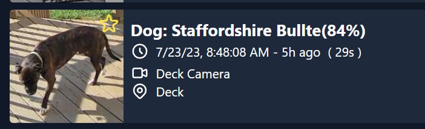

# Frigate Classifier

Identify breeds/species of dogs and birds detected by [blakeblackshear/frigate](https://github.com/blakeblackshear/frigate). This will try to identify a bird or dog and add a Frigate sublabel to that event.




### Setup

Create a `config.yml` file in your docker volume with the following contents:

```yml
frigate:
  frigate_url: http://127.0.0.1:5000
  mqtt_server: 127.0.0.1
  mqtt_auth: false
  mqtt_username: username
  mqtt_password: password
  main_topic: frigate
  camera:
    - birdcam
bird_classification:
  threshold: 0.7
dog_classification:
  threshold: 0.7
logger_level: INFO
```

Update your frigate url, mqtt server settings. If you are using mqtt authentication, update the username and password. Update the camera name(s) to match the camera name in your frigate config.

You can also update the threshold for the bird and dog classification. The threshold is the minimum confidence level for the classification to be considered valid. The default is 0.7.

If you dont want to classify birds or dogs, you can remove the `bird_classification` or `dog_classification` sections from the config.

### Running

```bash
docker run -v /path/to/config:/config -e TZ=America/New_York -it --rm --name frigate_classifier lmerza/frigate_classifier:latest
```

or using docker-compose:

```yml
services:
  frigate_classifier:
    image: lmerza/frigate_classifier:latest
    container_name: frigate_classifier
    volumes:
      - /path/to/config:/config
    restart: unless-stopped
    environment:
      - TZ=America/New_York
```

https://hub.docker.com/r/lmerza/frigateclassifier

### Debugging

set `logger_level` in your config to `DEBUG` to see more logging information:

```yml
logger_level: DEBUG
```

Logs will be in `/config/frigateclassifier.log`

### Training Dog Dataset

```bash
curl -O http://vision.stanford.edu/aditya86/ImageNetDogs/images.tar
mkdir -p dog_images
tar -xf images.tar -C dog_images --strip-components=1

python format_dog_dataset.py
python train_dog_model.py

or

nohup python train_dog_model.py > output.log 2>&1 &
```

### Attributions

The dog model was trained by [Stanford Dogs Dataset](http://vision.stanford.edu/aditya86/ImageNetDogs/)
